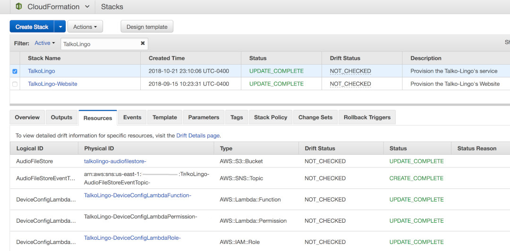

# Talko-Lingo
A demonstration project for the re:Invent Builder's Fair 2018

## Abstract

### Talko-Lingo: The multilingual Walkie Talkie

Talko-Lingo enables near real-time communication between two people of the same
or different languages. Users interface with a Walkie Talkie consisting of a
Raspberry Pi embedded into a 3D printed device. After selecting their language,
each user can seamlessly communicate with the recipient, who may be speaking a
different language. The project leverages AWS cloud technologies to encode each
user's voice, transcribe it, translate it to the target language and then
finally convert the translated text to speech. Built-in display mechanisms
provide visual feedback of the translation process.

### Project setup

#### A note for Windows users

The project has been built using Unix-like systems (OSX and Linux), and
therefore our instructions are Unix-oriented. We think that the easiest way to
deploy Talko-Lingo on Windows would be to spin-up a small `Docker` linux
container and follow our instructions, but there is no reason why you couldn't
setup the project on a Windows system using something like `MinGW`. Also, note
that the core of our code is python-based, which is cross-platform so the only
thing an experienced user would have to adapt would be our `bash` and `make`
deploying scripts, which you can work-around with native utilities.

#### Prerequisites: Shared resources

In order to deploy the Cloud resources required by the Talko-Lingo project, we
have prepared some CloudFormation templates for you.

It provisions the following resources:
- An audio bucket that will be used as temporary storage for the audio
processing
- The Tx and Rx lambdas, respectively used for transmitting messages to the
other party and receiving the responses.
- The IoT resources used to publish and subscribe to MQTT topics
- A Web UI to follow the progress of messages through the pipeline

In order to get started, open your AWS console in your browser. On the
command-line you should be able to simply execute the following command to get
things deploying:

```
make deploy-talko-lingo
```

After a couple of minutes, you should start to see resources being created in
your environment:


#### Project Setup

In order to complete your own Talko-Lingo pair of Walkie-Talkies, we did put
together a step-by-step tutorial to get you going. Note that these are only
suggestions and we encourage you to make you own version of these if your setup
differs from ours: There are many ways to adapt this project to other types of
hardwares.

2. [Raspberry Pi Software Setup](docs/README_RASPBERRY_PI.md)
3. [Raspberry Pi Hardware Setup](docs/README_HARDWARE.md)
4. [Case 3D Printing](docs/README_3D_PRINTING.md)

If all is went well, you should have a fully-functional Walkie-Talkie setup!
As a bonus, you can tweak it to work over WiFi and communicate over hundreds of
kilometers :-)

And if you want to contribute, of course we accept PRs :-)
