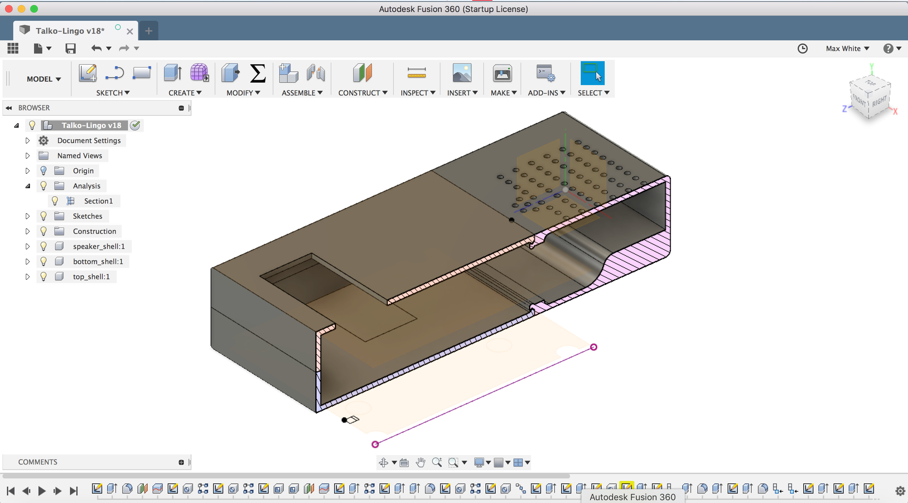
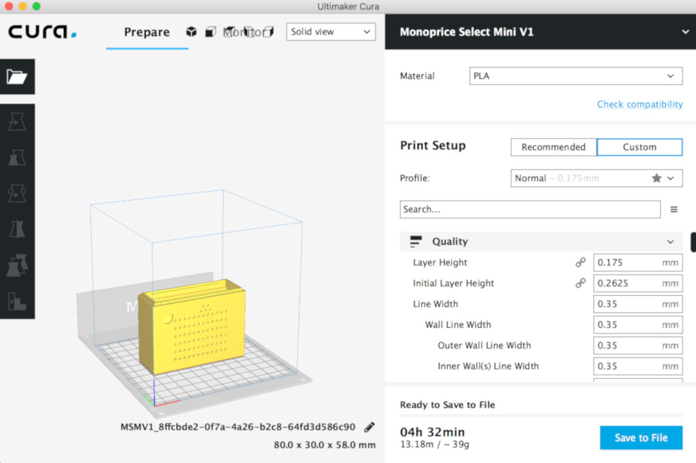
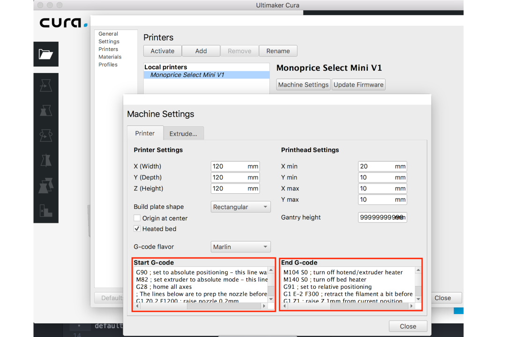
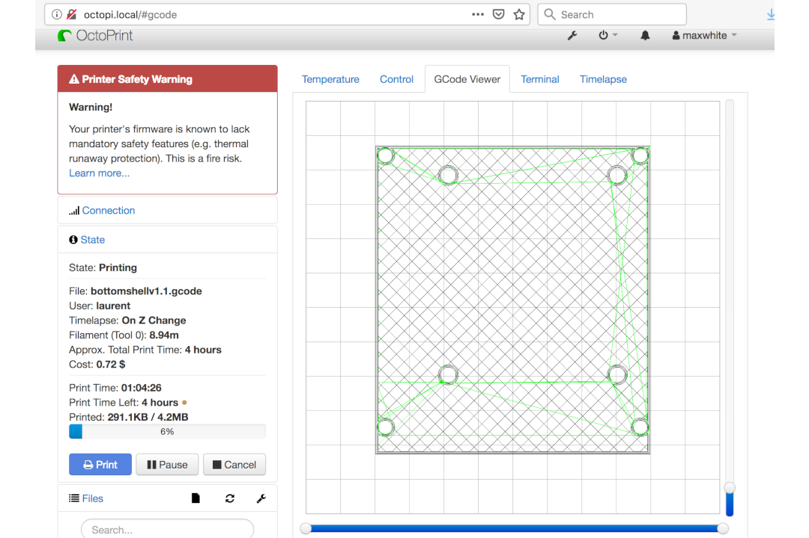
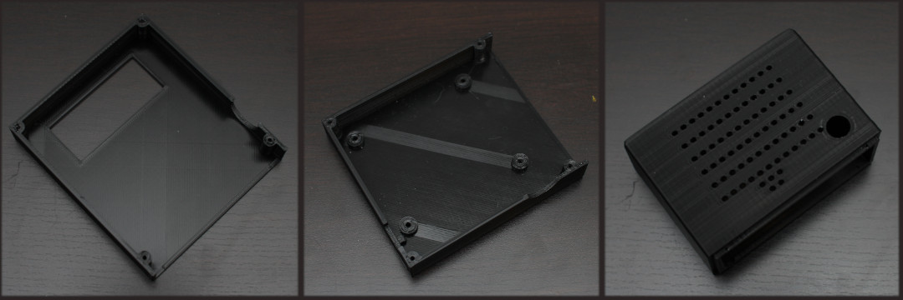

## 3D printing

### Fusion 360

We designed our case using the [Fusion360](https://www.autodesk.com/products/fusion-360/overview) software. Although it is a commercial product, it is free for hobbyists, you just need to activate your license after installing the free trial.

You will find in the `3d-printing` folder of the present project everything you need to print the plastic-case yourself: the file `Talko-Lingo.f3d` can be imported directly to the Fusion 360 if you wish to make adjustments to the the model (adjusting screw sizes, for example).



### Cura

The model is composed of three components: The bottom shell where the Raspberry Pi sits, the top shell where the screen is place and the speaker shell where the speaker, rotary switch and microphone are incorporated. You will find in the `3d-printing` folder of this repository the `STL` file of each of those components which you can send directly to a _slicer_ software like [Cura](https://ultimaker.com/en/products/ultimaker-cura-software).



It will take care of generating the `gcode` file that most printers will support. There is a pretty large amount of parameters, but Cura has a preset for most popular 3D printers on the market. In our case, we used a [Monoprice MP Select Mini V1](https://www.monoprice.com/product?c_id=107&cp_id=10724&cs_id=1072403&p_id=31429&seq=1&format=2) printer with default settings except for one thing: the `Start G-Code` and `End G-Code`, which we took from [their website](https://mpselectmini.com/starting_ending_g-code_scripts) and gives better overall performance.

#### Starting G-code
 ```
G90 ; set to absolute positioning - this line was added in case Cura doesn't include it by default
M82 ; set extruder to absolute mode - this line was added in case Cura doesn't include it by default (may not be needed)
G28 ; home all axes
; The lines below are to prep the nozzle before a print begins
G1 Z0.2 F1200 ; raise nozzle 0.2mm
G92 E0 ; reset extrusion distance
G1 Y10 ; move Y-Axis (bed) 10mm to prep for purge
G1 X100 E12 F600 ; move X-carriage 100mm while purging 12mm of filament
G92 E0 ; reset extrusion distance
 ```
#### Ending G-code

```
M104 S0 ; turn off hotend/extruder heater
M140 S0 ; turn off bed heater
G91 ; set to relative positioning
G1 E-2 F300 ; retract the filament a bit before lifting the nozzle to release some of the pressure
G1 Z1 ; raise Z 1mm from current position
G1 E-2 F300 ; retract filament even more
G90 ; set to absolute positioning
G1 X20 ; move X axis close to tower but hopefully far enough to keep the fan from rattling
G1 Y120 ; move bed forward for easier part removal
M84 ; disable motors
G4 S360 ; keep fan running for 360 seconds to cool hotend and allow the fan to be turned off - adjust to your needs
M107 ; turn off fan. Don't use M106 S1. Some say M107 doesn't work for them but if the hotend is below 70 degrees it should work
```



### OctoPrint

Finally, when the model has been sliced and we are satisfied with the preview it gives, the last stage before the actual printer was to upload it to OctoPi, a RaspberryPi equipped with the [OctoPrint](https://octoprint.org) software.



Just verify that all the parameters seem OK, and print-away!

### Results

In the end, you will have those three plastic components:



Talko-Lingo is now ready to assemble! :-)
