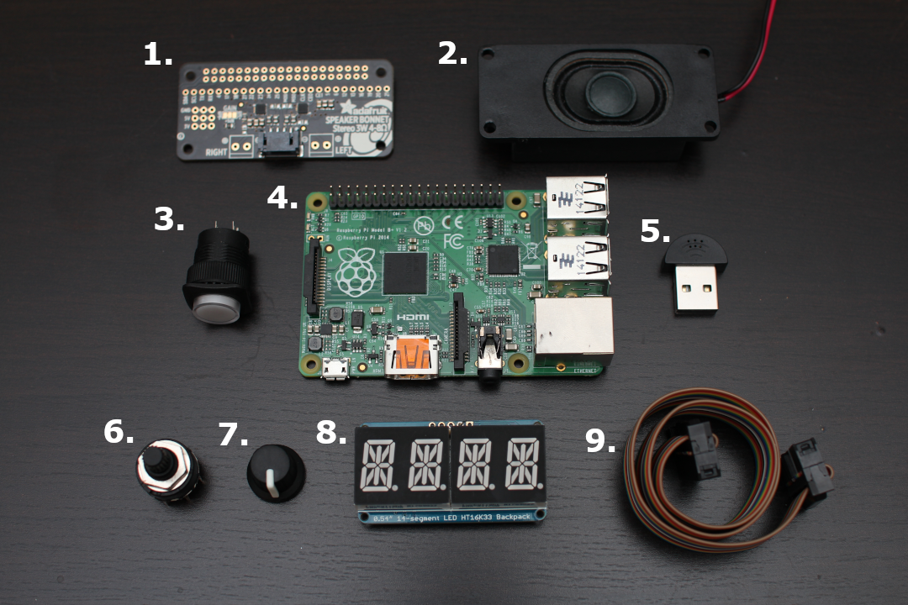
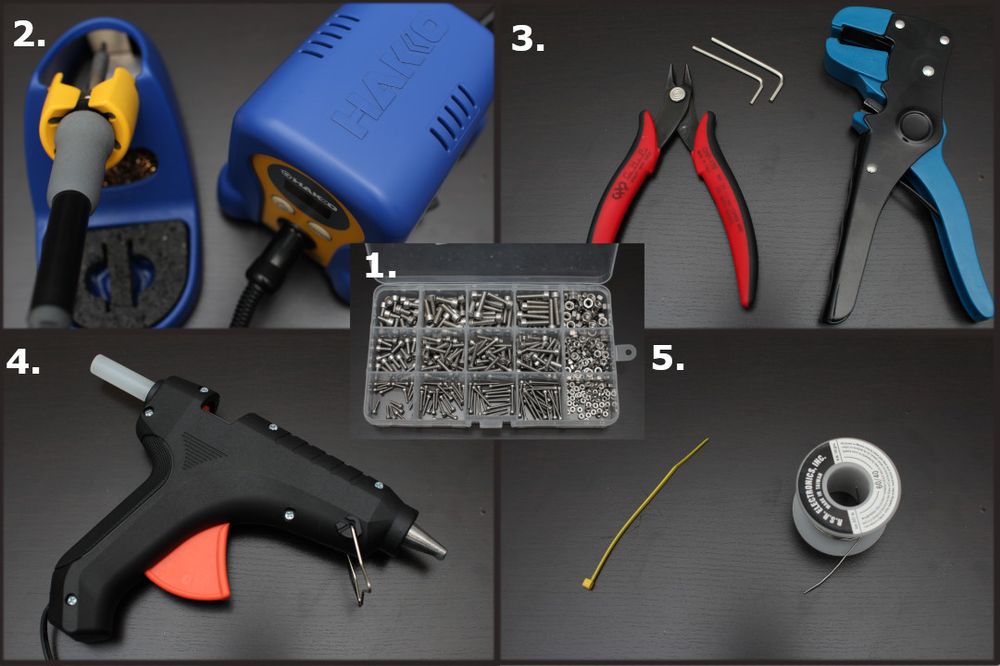
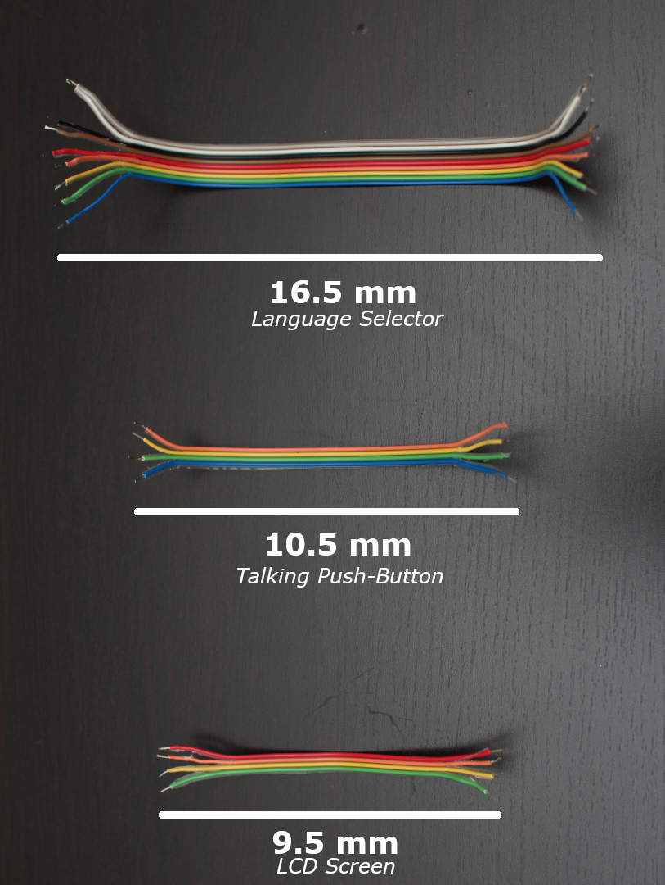
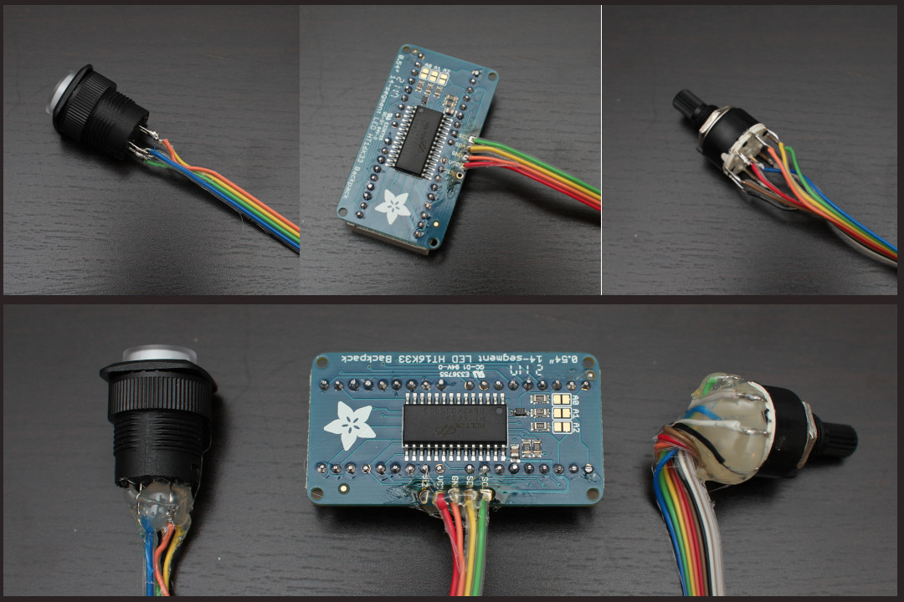
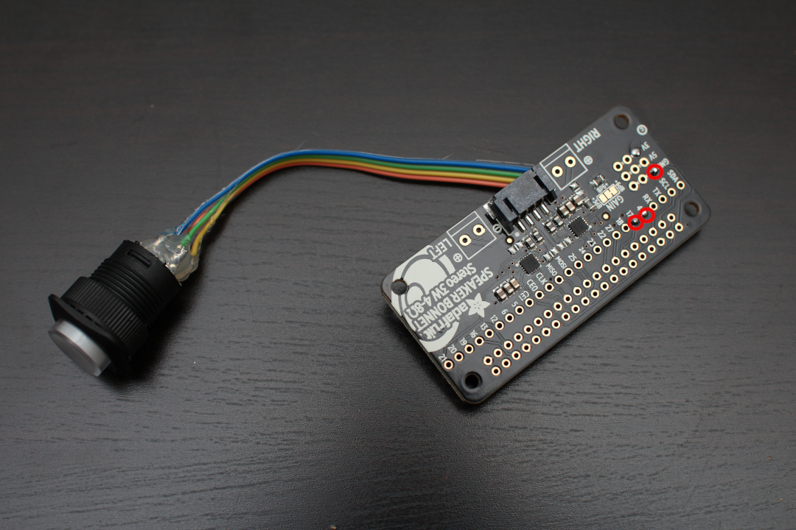
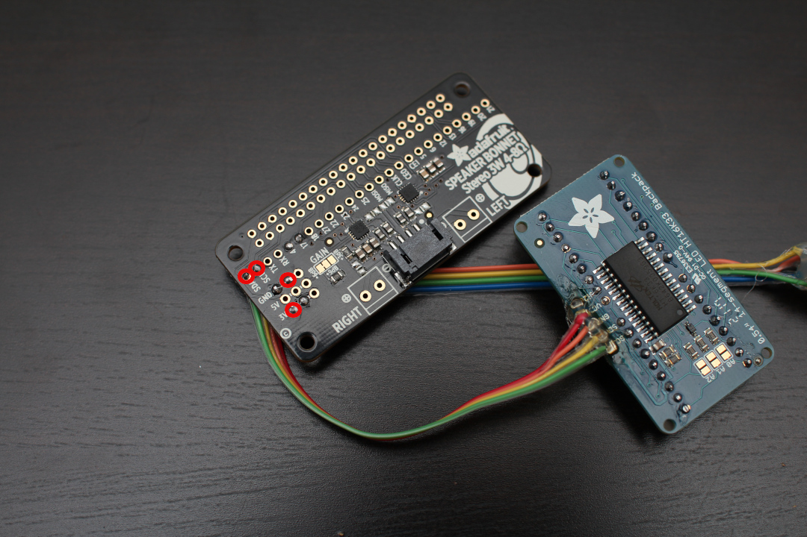
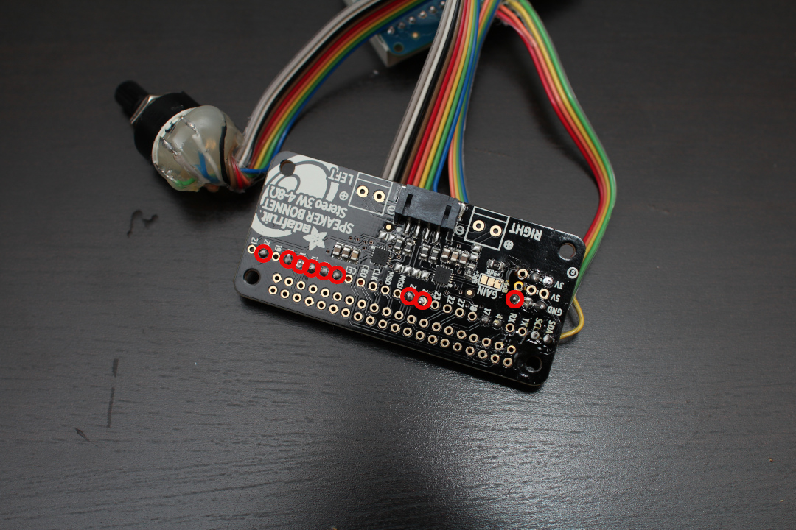

## Required hardware

In order to complete this project, you will need two copies of each of those things:

1. **Adafruit's Speaker Bonnet**: An I2S stereo amplifier for the Raspberry Pi. It connects directly to the GPIO and exposes most useful pins. *Warning*: It makes use of pins **19** and **21** even if they are re-exposed. Do not use them if you intend to play sound at the same time. [Available here](https://www.adafruit.com/product/3346)
2. **Adafruit's 3W 4Ohm Speakers**: The speakers normally coming with the bonnet aforementioned. [Available here](https://www.adafruit.com/product/3351)
3. **Adafruit's 16mm Illuminated Pushbutton**: A simple push button equipped with a 3V LED light. [Available here](https://www.adafruit.com/product/1479)
4. **A Raspberry Pi 3**: We made our tests using a Raspberry Pi model B, but a model A, B+ or A+ should work just as well... [Available here](https://www.buyapi.ca/product/raspberry-pi-3-model-b-plus/)
5. **Adafruit's Mini USB Microphone**: A very simple microphone. Be careful, from what we have tested, the quality can be inconsistent... [Available here](https://www.adafruit.com/product/3367)
6. **Adafruit's Mini 8-Way Rotary Selector Switch**: We chose an 8-position rotary switch, but a rotary encoder could be a superior choice. [Available here](https://www.adafruit.com/product/2925)
7. **Adafruit's Potentiometer Knob**: Just to put on the previously mentioned Rotary Selector so that it looks *sexier*. [Available here](https://www.adafruit.com/product/2047)
8. **Adafruit's Alphanumeric Display with its I2C Backpack**: Adafruit has a really easy-to-use LED alphanumeric display, including very well detailed tutorial for Raspberry Pi.. [Available here](https://www.adafruit.com/product/1911)
9. **A flat ribbon cable**: We chose to use a rainbow-colored flat ribbon for ease of use, but really anything you have on-hand will do the job ;-)

## Other required tools

1. **A set of electronic-sized screws**: Our [3D model]() *--Include Fusion3D gallery link--* includes placeholders for 2mm x 22mm screws. If you don't have the exact screw model we used, you can always modify the model's [parameters](https://www.youtube.com/watch?v=apkUQKNwHIo) to fit your needs.

2. **A soldering iron**: This project requires quite a bit of soldering, so you will have to find a soldering iron. There are a lot of different qualities, but in our case we used the [Hakko FX888D]( https://www.hakko.com/english/products/hakko_fx888d.html) model.

3. **Wire-cutting instruments**: Again, a nice-to-have but those will just make your life easier.

4. **A glue gun with sticks**: This one might not be absolutely necessary, but we found that it helps protecting and solidifying the whole setup against short-circuits and accidental impacts.

5. **Soldering lead**: Of course you will need some lead to do soldering. We used [RSR Electronic's](https://www.elexp.com/ProductDetails.aspx?item_no=060701&CatId=c98e6dbc-415b-4cfe-8661-15f3ec0b88ec) Resin-cored spool. It is much easier to work with for newbies like us, but do not abuse it because it contains toxic chemicals.

## Assembly

### The wires

First, you will need to prepare some cables to connect the components to the speaker bonnet. In our setup, we used these cable lengths:

Next, you should begin by soldering the individual components to the aforementioned wires. By convention, we tried to keep red/orange wires for positive DC current and black/blue wires for the ground, but we couldn't follow those standards all the way.

In our case, the result looks like this:

Notice that as previously said, we used hot glue in order to isolate and harden the fragile wires to our components. There is probably a more professional way, but this one works well for our use-case and is cheap and easy to use.

### The speaking push-button

Once the components are soldered to their wires, you can go-on and begin hooking-them up to the speaker bonnet. We suggest starting with the push-button with the following pin associations:

- The negative (-) pin of the push-button and one of the data pins together in one of the ground pins of the speaker bonnet, since all the ground wires of the circuit are considered the same, and we will need all of them.

- The positive (+) pin of the push-button hooked to the GPIO pin #4 of the speaker bonnet. In theory, we would also need a small resistance (220Ω to 1000Ω) just to be sure, but our tests seem to be conclusives without one...

- The last data pin of the push button to the GPIO pin #17. This will be used to trigger when the user has something to say.

### The LED display

This component is pretty straight-forward, you only have 4 wires to solder (plus the LED displays to their backpack, of course...):

- The VCC (+) and GND (-) are soldered to a 3.3V and a ground pin from the speaker bonnet respectively. Note that we do not use the Vi2c pin, so make sure you have the good one.

- SDA and SCL are soldered to their respective pins on the speaker bonnet. **Note that the pins are inverted on the LED backpack compared to the bonnet.** Make sure you don't invert them or it will not work.

### The rotary selector switch

This last component needs a little more attention, as there are 9 pins to solder:

- There is a "centered" pin which we will use to connect the ground.

- The other pins will be soldered to GPIO pins #20, 16, 13, 12, 6, 5, 25 and 24.

Note that the choice of pin is arbitraty, but you **cannot choose the pins 19 or 21**, as they are reserved by the speaker bonnet.

### Final result

The final result should look like something similar to this:

On the left part, you have the resulting piece of hardware that has just been soldered. But in order to protect our newly soldered wiring, the right side of the picture shows how we used hot glue to isolate and harden our setup.

## 3D printing

Once we have the components soldered together, we can 3D-print a case
